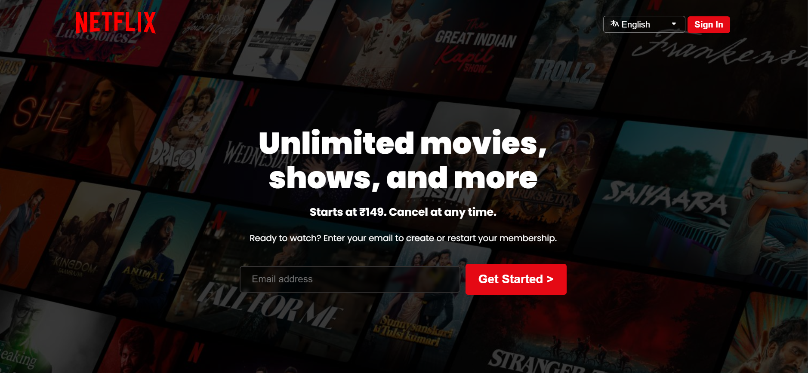
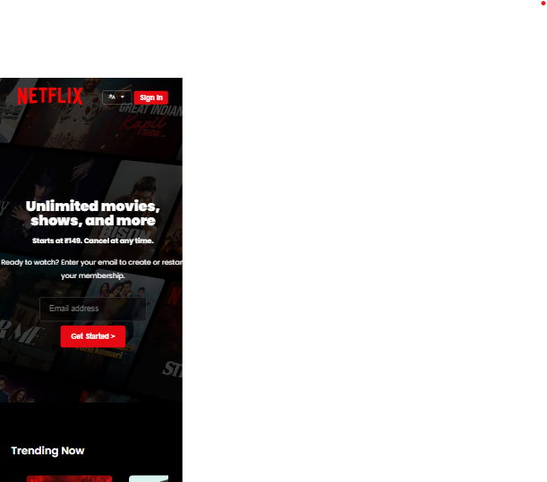

# Netflix Landing Page Clone 🍿

A clean, responsive Netflix landing page clone built **100% from scratch** using only **HTML & CSS**.
No JavaScript. No frameworks. Just pure frontend hustle.

📍 **Repo:** [https://github.com/ankitprajapati999/Netflix-UI-Clone.git](https://github.com/ankitprajapati999/Netflix-UI-Clone.git)

---
<hr>

## 🌍 Live Demo

🔗 [Demo Site](https://really-the-demo.vercel.app/)
(Live on GitHub Pages — because static sites rule.)

---

## 💡 What This Is

This isn’t a Netflix app — it’s the landing page vibe:

* Hero header that says *“This looks familiar…”*
* Slick responsive layout
* Effects that don’t suck
* Built with HTML & CSS like an absolute unit

It’s lightweight, clean, and looks way more expensive than the codebase.

---

## 🧠 Why I Made This

Because frameworks are fun, but fundamentals are **rad**.
This project proves:

> You can make non-trivial UI without a single JS line.

Frontend magic isn’t about tools — it’s about knowing how the browser actually works.

---

## 🚀 How to Use

Just clone and open it in your browser.

```bash
git clone https://github.com/ankitprajapati999/Netflix-UI-Clone.git
cd Netflix-UI-Clone
open index.html
```

Boom. Instant Netflix-but-not-Netflix.

---

## 🎯 Tech Stack

HTML5
CSS3 (Grid, Flexbox, Responsive goodness)

That’s it. No ✨ JavaScript ✨. No ✨ NPM ✨. No ✨ drama ✨.

---

## 📸 Screenshots


*Looks crisp.*


*Also vibes on smaller screens.*

---

## 👤 Built By

**Ankit Prajapati (aka lightning ankit)⚡**
Just a dude learning frontend, making a few cool clones, and breaking stuff on purpose.

---

## 📜 License

Feel free to use, remix, study, or roast this code.
Just don’t say you wrote it in 5 minutes 😌


just put a line **"source: trust me bro"** with my name 😁

---
